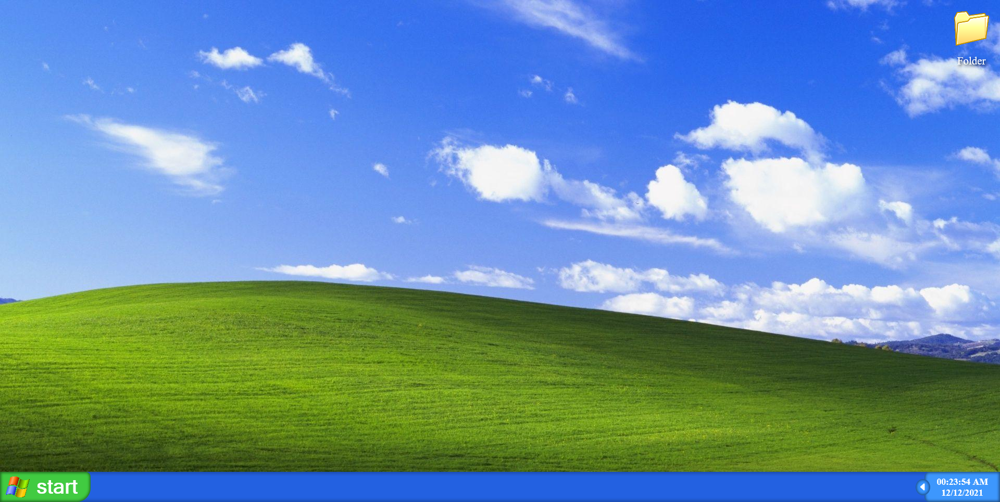
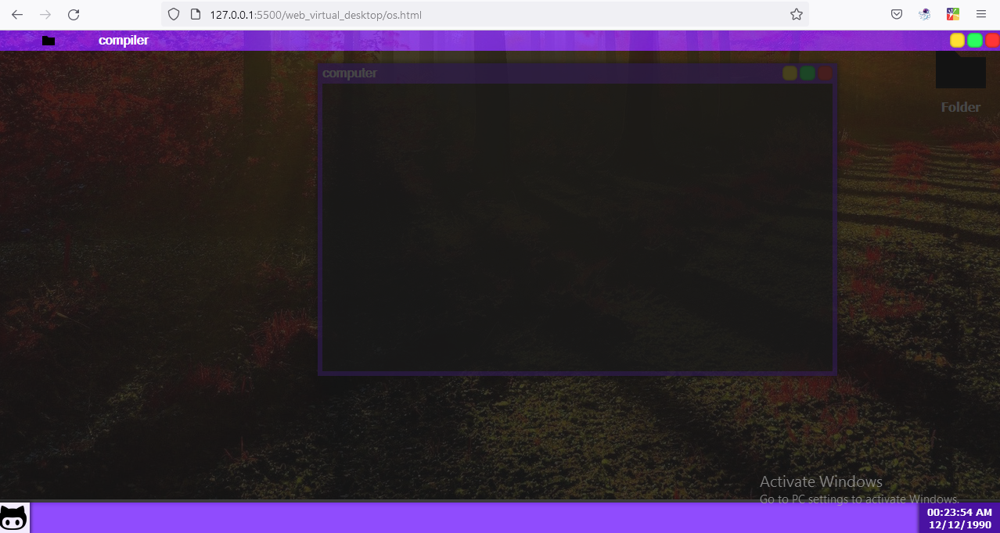

<h1> Virtual Desktop Environment </h1>

 

<h3> 
- this project for  building a virtual desktop environment  as a  web-app  .   
- this project also for testing the ability of <a href="https://github.com/Mouradouchane/DesktopJS"> DesktopJS
</a> 
library .
</h3>

 
<h1> Note : </h1>

<h3> 
- this project need 
<a href="https://github.com/Mouradouchane/DesktopJS"> DesktopJS </a> to work properly .
 
- you can use this project to build your own desktop environment .
</h3>

 
<h1> Preview </h1>

<h1> Contributors </h1>

* Mourad Ouchane <a href="https://github.com/Mouradouchane" > ouchane_cc </a> 

* Abderrahman DAKIR ALLAH <a href="https://github.com/black-purple"> black-purple </a> 
